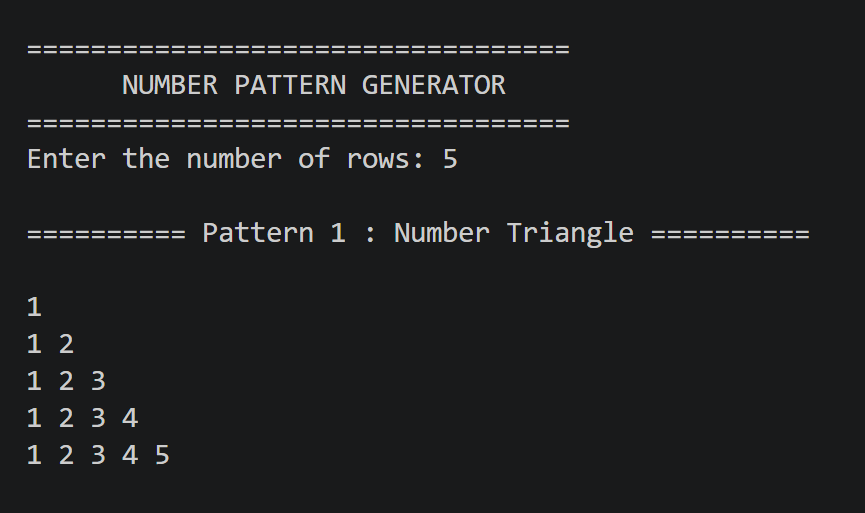
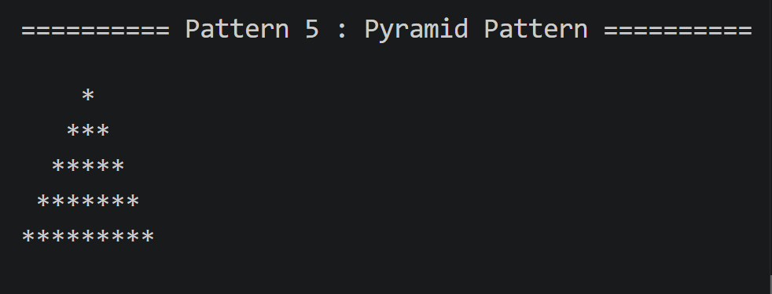

# Java Number Pattern Generator

A console-based Java application that prints different types of number and star patterns based on the number of rows entered by the user. This project was created to improve logical thinking, nested loop concepts, and Java programming skills.

---

## About the Project

This application allows users to enter the desired number of rows and generates multiple patterns in a single execution. It is a beginner-friendly Java project that focuses on implementing different looping techniques and pattern-building logic.

---

## Patterns Included

- Number Triangle
- Star Triangle
- Floyd's Triangle
- Inverted Star Triangle
- Pyramid Pattern
- Diamond Pattern
- Butterfly Pattern
---

## Technologies

- Java
- Visual Studio Code
- Scanner Class

---

## Concepts Practiced

- Nested Loops
- User Input
- Pattern Printing
- Variables
- Conditional Logic

---

## Running the Program

Compile the source file:

```bash
javac NumberPattern.java
```

Run the application:

```bash
java NumberPattern
```

---

## Project Files

```
Task2_NumberPattern
│── NumberPattern.java
│── README.md
└── screenshots
    ├── pattern1.png
    ├── pattern3.png
    └── pattern5.png
```

---

## Output Preview

### Number Pattern



### Continuous Number Pattern


### Pyramid Pattern



---

## Future Enhancements

- Hollow Star Patterns
- Diamond Pattern
- Pascal Triangle
- Alphabet Patterns
- Menu-Based Pattern Selection

---

## What I Learned

This project helped me strengthen my understanding of:

- Looping structures in Java
- Nested loop implementation
- Console-based application development
- Writing clean and readable code

---

##  Developer

**Priya Dayma**

B.Tech Computer Science Engineering

---

