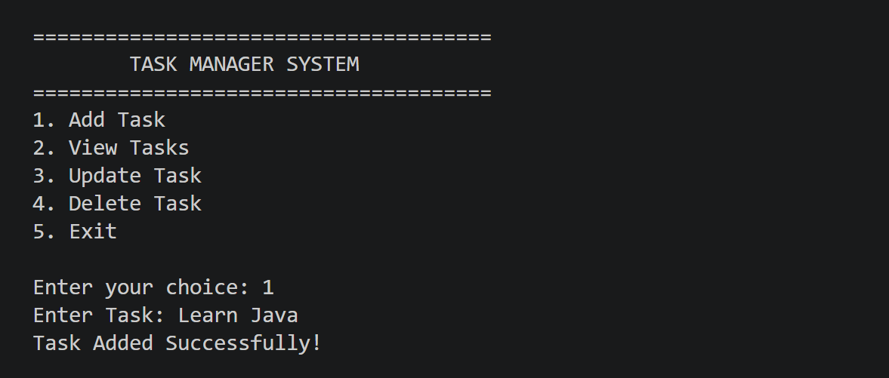
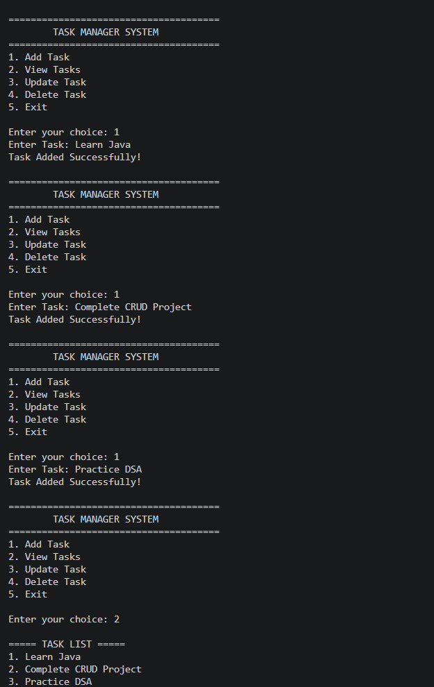
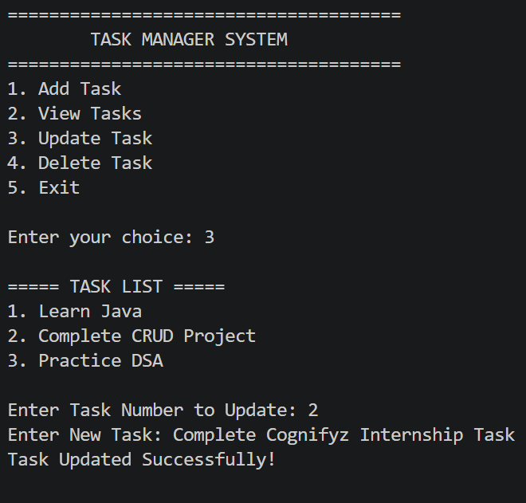
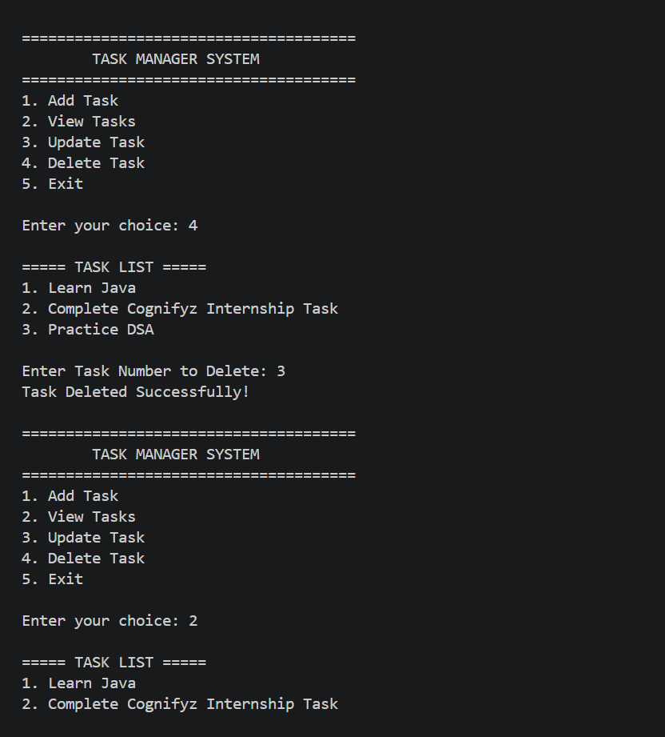

#  Java Task Manager (CRUD Operations)

A console-based Java application that allows users to manage daily tasks using basic **CRUD (Create, Read, Update, Delete)** operations. This project was developed as part of the **Cognifyz Technologies Software Development Internship** to strengthen Java programming and problem-solving skills.

---

##  About the Project

The Task Manager is a simple console application that helps users organize their tasks efficiently. It provides an interactive menu where users can add, view, update, and delete tasks during program execution.

This project demonstrates the implementation of Java fundamentals while building a practical application.

---

##  Features

-  Add New Task
-  View All Tasks
-  Update Existing Task
-  Delete Task
-  Exit the Application
-  User-Friendly Console Menu
-  Input Validation for Invalid Task Numbers

---

##  Technologies Used

- Java
- Visual Studio Code
- ArrayList
- Scanner Class

---

##  Java Concepts Practiced

- ArrayList
- CRUD Operations
- Methods
- Loops
- Switch Case
- Conditional Statements
- User Input Handling
- Input Validation

---

##  How to Run

### Compile

```bash
javac TaskManager.java
```

### Run

```bash
java TaskManager
```

---

##  Project Structure

```text
Task3_TaskManager
│── TaskManager.java
│── README.md
└── screenshots
    ├── add_task.png
    ├── view_tasks.png
    ├── update_task.png
    └── delete_task.png
```

---

##  Output Preview

###  Add Task



---

###  View Tasks



---

###  Update Task



---

###  Delete Task



---

##  Future Enhancements

- Search Task
- Mark Task as Completed
- Store Tasks in a File
- Task Priority Levels
- Date & Time Support
- Menu with Colors (GUI Version)

---

##  Learning Outcomes

Through this project, I learned:

- Performing CRUD operations using ArrayList
- Working with Java Collections
- Building menu-driven console applications
- Managing user input effectively
- Applying Java fundamentals to a practical project

---

##  Developer

**Priya Dayma**

B.Tech Computer Science Engineering

Passionate about Java Development, Problem Solving, and Software Engineering.

---
