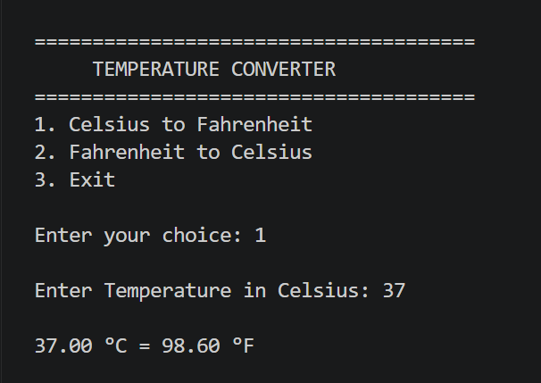
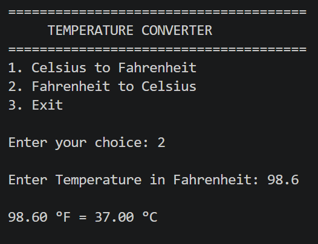
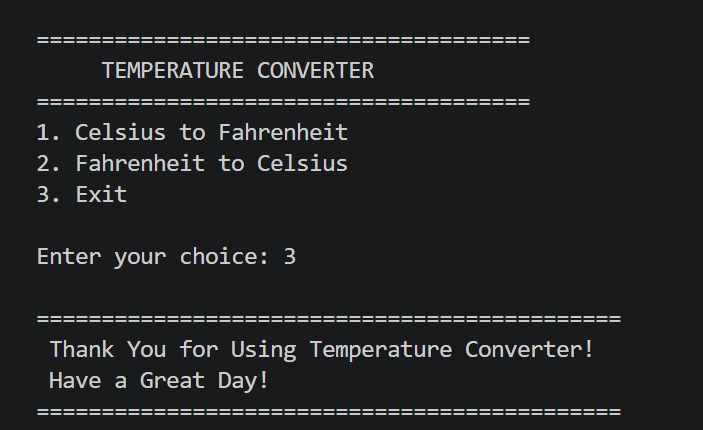

# Java Temperature Converter

A simple and interactive console-based Java application that converts temperatures between **Celsius** and **Fahrenheit**. This project was developed as part of the **Cognifyz Technologies Software Development Internship** to practice Java programming fundamentals and mathematical calculations.

---

## About the Project

The Temperature Converter allows users to convert temperatures in both directions:

- Celsius → Fahrenheit
- Fahrenheit → Celsius

The application uses a menu-driven interface, accepts user input, performs accurate temperature conversions, and displays the converted values in an easy-to-read format.

---

## Features

- Celsius to Fahrenheit Conversion
- Fahrenheit to Celsius Conversion
- Menu-Driven Console Interface
- Supports Decimal Values
- Fast and Accurate Calculations
- Exit Option
- Beginner-Friendly Java Project

---

## Technologies Used

- Java
- Visual Studio Code
- Scanner Class

---

## Java Concepts Practiced

- Methods
- Loops
- Switch Case
- Variables
- User Input
- Arithmetic Operations
- Conditional Statements

---

## How to Run

### Compile

```bash
javac TemperatureConverter.java
```

### Run

```bash
java TemperatureConverter
```

---

## Project Structure

```text
Task4_TemperatureConverter
│── TemperatureConverter.java
│── README.md
└── screenshots
    ├── celsius_to_fahrenheit.png
    ├── fahrenheit_to_celsius.png
    └── exit.png
```

---

## Output Preview

### Celsius to Fahrenheit



---

### Fahrenheit to Celsius



---

### Exit



---

## Future Enhancements

- Kelvin Conversion
- Temperature History
- Multiple Unit Support
- GUI Version using Java Swing
- Input Validation for Invalid Data

---

## Learning Outcomes

Through this project, I learned:

- Performing temperature conversions using mathematical formulas
- Building menu-driven console applications
- Handling user input using Scanner
- Applying Java programming fundamentals
- Creating clean and structured Java programs

---

## Developer

**Priya Dayma**

B.Tech Computer Science Engineering

Passionate about Java Development, Problem Solving, and Software Engineering.

---
