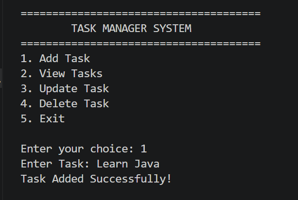
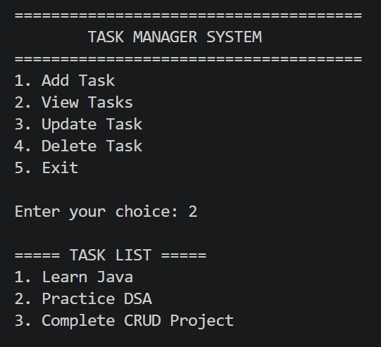
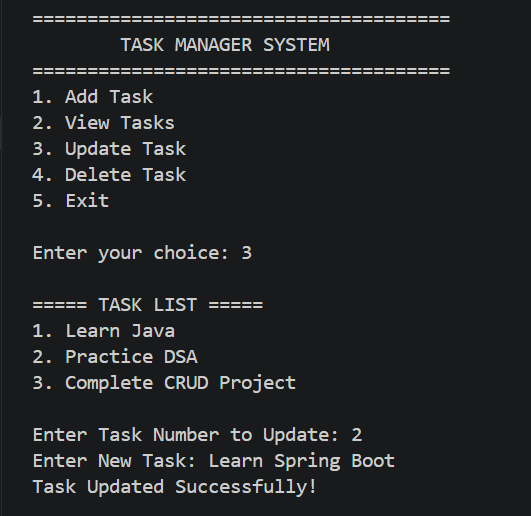
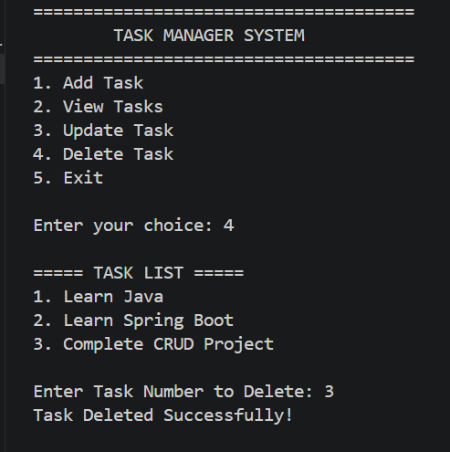
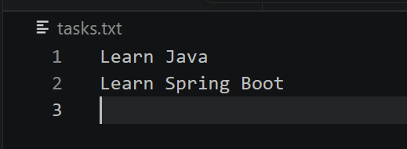

# Java Task Manager with File I/O

A simple and interactive console-based Java application that helps users manage daily tasks. This project was developed as part of the **Cognifyz Technologies Software Development Internship** to practice Java programming, File I/O operations, and CRUD functionality.

---

## About the Project

The Task Manager allows users to organize and manage their daily tasks through a menu-driven console interface. It stores tasks in a text file, ensuring that all data is saved permanently and automatically loaded whenever the application starts.

Users can:

- Add new tasks
- View all tasks
- Update existing tasks
- Delete tasks
- Save tasks to a file
- Load saved tasks automatically

---

## Features

- Add New Task
- View All Tasks
- Update Existing Task
- Delete Task
- Automatic Task Saving
- Automatic Task Loading
- File I/O using Text File
- Menu-Driven Console Interface
- Beginner-Friendly Java Project

---

## Technologies Used

- Java
- Visual Studio Code
- ArrayList
- Scanner Class
- File I/O
- BufferedReader
- BufferedWriter

---

## Java Concepts Practiced

- ArrayList
- Methods
- Loops
- Switch Case
- File Handling
- BufferedReader
- BufferedWriter
- Exception Handling
- CRUD Operations
- User Input

---

## How to Run

### Compile

```bash
javac TaskManagerFileIO.java
```

### Run

```bash
java TaskManagerFileIO
```

---

## Project Structure

```text
Task5_TaskManager_FileIO
│── TaskManagerFileIO.java
│── tasks.txt
│── README.md
└── screenshots
    ├── add_task.png
    ├── view_tasks.png
    ├── update_task.png
    ├── delete_task.png
    └── tasks_file.png
```

---

## Output Preview

### Add Task



---

### View Tasks



---

### Update Task



---

### Delete Task



---

### Tasks File

This screenshot shows that all tasks are stored permanently in **tasks.txt** using File I/O.



---

## Future Enhancements

- Task Priority (High, Medium, Low)
- Due Date Support
- Search Tasks
- Mark Tasks as Completed
- GUI Version using Java Swing
- Database Integration using MySQL

---

## Learning Outcomes

Through this project, I learned:

- Performing CRUD operations using Java
- Reading and writing data using File I/O
- Managing collections using ArrayList
- Handling user input using Scanner
- Building menu-driven console applications
- Implementing persistent data storage

---

## Developer

**Priya Dayma**

B.Tech Computer Science Engineering

Passionate about Java Development, Problem Solving, and Software Engineering.

---