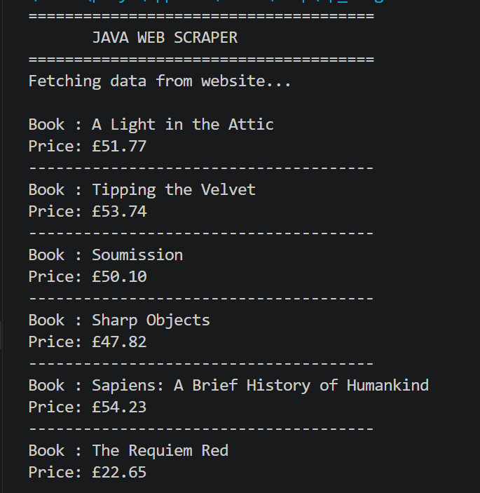
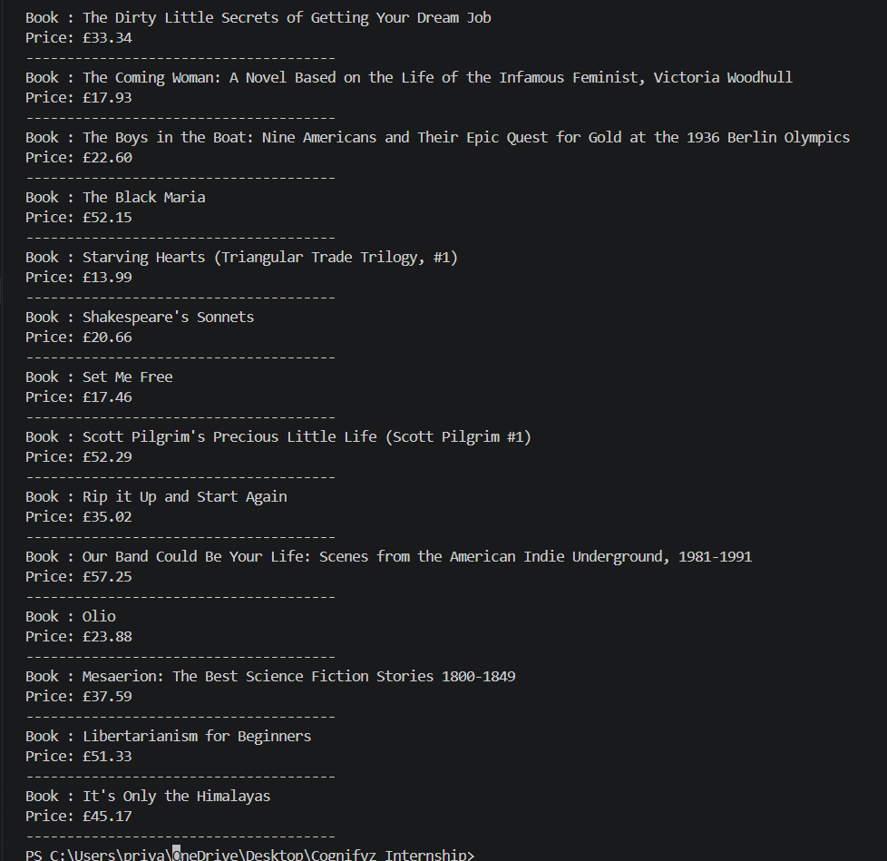

# Java Web Scraper

A console-based Java application that fetches and displays book titles and prices from a website using the Jsoup HTML parser library. This project demonstrates basic web scraping techniques in Java.

---

## About the Project

This application connects to a website, retrieves HTML content, extracts book titles and prices, and displays the information in the console. It is a beginner-friendly project to learn web scraping using Java.

---

## Features

- Connects to a live website
- Fetches HTML content
- Extracts Book Titles
- Extracts Book Prices
- Displays data in the console
- Exception Handling

---

## Technologies Used

- Java
- Jsoup Library
- Visual Studio Code

---

## Concepts Practiced

- Web Scraping
- HTML Parsing
- CSS Selectors
- Exception Handling
- Java Libraries
- HTTP Requests

---

## Website Used

https://books.toscrape.com/

---

## Running the Program

Add the Jsoup library to your project.

Compile the source file:

```bash
javac WebScraper.java
```

Run the application:

```bash
java WebScraper
```

---

## Project Structure

```text
Task6_WebScraping
│── WebScraper.java
│── README.md
└── screenshots
    ├── output.png
    └── books.png
```

---

## Output Preview

### Fetching Book Details



---

### More Books



---

## What I Learned

This project helped me strengthen my understanding of:

- Web Scraping using Java
- Working with the Jsoup Library
- HTML Document Parsing
- CSS Selectors
- Exception Handling
- Console-Based Java Applications

---

## Developer

**Priya Dayma**

B.Tech Computer Science Engineering